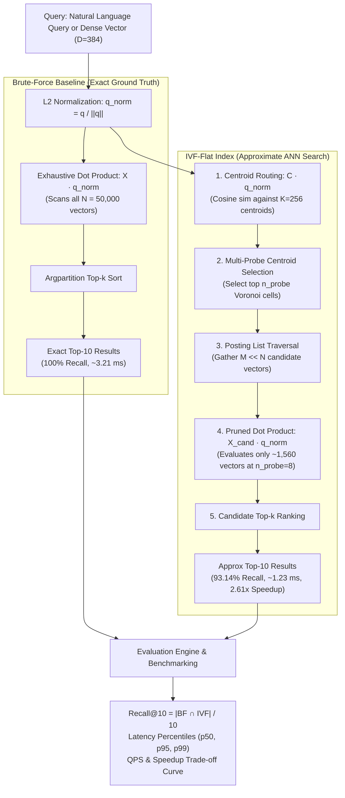

# ⚡ Custom Vector Database Engine from Scratch

> **"No Pinecone. No FAISS. No Chroma. No sklearn.neighbors."**  
> A high-performance Approximate Nearest Neighbor (ANN) Vector Database written entirely from first principles using **pure NumPy for arithmetic**.

---

## 📌 Features & Highlights

- **Pure First-Principles Implementation**: Zero imports of vector search engines (`faiss`, `pinecone`, `chromadb`, `sklearn.neighbors`, `scipy.spatial.KDTree`). All matrix operations, distance calculations, and clustering are written with pure NumPy.
- **Dual Index Architectures**:
  1. **Brute-Force Index (`BruteForceIndex`)**: Exact $O(N)$ linear scan serving as the mathematical ground truth.
  2. **Inverted File Index (`IVFFlatIndex`)**: Voronoi cell partitioning via custom Spherical $K$-Means clustering written from scratch, supporting dynamic multi-probe routing ($n_{\text{probe}}$).
  3. **Hierarchical Graph Index (`HNSWIndex`)**: Multi-layer skip-graph navigation with beam search and tombstone deletion.
- **Unified Vector Database API**:
  - `insert(vector_id, vector, metadata)`
  - `search(query_vector, top_k, ...)`
  - `delete(vector_id)` (with exact swap-and-pop list compaction for IVF-Flat and tombstoning for HNSW)
- **50,000 Vector Scale with Real Semantics**:
  - Encoded 5,000 real sentences from the AG News corpus using `all-MiniLM-L6-v2` (`dim=384`).
  - Expanded the 5,000 real-text embeddings to a 50,000-vector benchmark corpus using controlled Gaussian perturbations ($\sigma=0.03$, `SEED=42`).
- **Rigorous Evaluation Suite**:
  - 500 test queries evaluated against exact ground truth.
  - Automated measurement of Recall@10, latency percentiles ($p50, p95, p99$), QPS, and speedup trade-off curves.
- **Interactive Demonstrator & REST API**:
  - **FastAPI REST Service** (`api/server.py`) exposing `/search`, `/insert`, `/delete`, and `/stats` with Swagger OpenAPI documentation (`http://localhost:8000/docs`).
  - Sleek **Streamlit Web UI** (`demo/app.py`) for live natural language query search, side-by-side comparison, and real-time deletion testing.
  - Interactive **CLI Terminal Demo** (`demo/cli_demo.py`).

---

## 🏗️ Architecture & Search Flow

The system benchmarks an exact mathematical baseline against an inverted approximate index to quantify the trade-off between retrieval speed and recall accuracy:



---

## 📂 Project Structure

```
VectorDB/
├── vectordb/                    # Core Vector Database Engine (Pure NumPy)
│   ├── __init__.py              # Package exports (BruteForce, IVFFlat, HNSW)
│   ├── base.py                  # BaseVectorIndex abstract base interface
│   ├── distance.py              # L2 normalization, cosine similarity, euclidean distance
│   ├── brute_force.py           # Exact linear scan ground truth oracle
│   ├── ivf_flat.py              # Inverted file index with Voronoi cells & posting lists
│   ├── hnsw.py                  # Hierarchical Navigable Small World skip-graph index
│   └── kmeans.py                # Scratch K-Means (k-means++ initialization & Lloyd's iteration)
├── api/
│   └── server.py                # FastAPI REST API with endpoints, rollback, & telemetry
├── data/
│   ├── prepare_data.py          # Data pipeline: AG News encoding, synthetic mode, & ground truth
│   └── corpus/                  # Dataset storage (auto-downloads ag_news_train.csv)
├── demo/
│   ├── app.py                   # Streamlit interactive Web UI dashboard
│   └── cli_demo.py              # Terminal interactive CLI demonstrator
├── evaluation/
│   ├── benchmark.py             # 500-query benchmark runner & trade-off curve plotter
│   ├── reporter.py              # Automated Markdown benchmark report generator
│   └── results/                 # Evaluation artifacts
│       ├── benchmark_summary.json  # Latencies (mean/p50/p95/p99), QPS, and recall sweeps
│       └── tradeoff_curve.png   # Generated Recall vs. Latency Pareto curve
├── tests/
│   ├── test_api.py              # FastAPI REST endpoint integration tests
│   ├── test_distance.py         # Math and distance primitive unit tests
│   ├── test_indices.py          # CRUD lifecycle, compaction, and tombstoning tests
│   └── test_kmeans.py           # Scratch K-Means convergence tests
├── docs/                        # Comprehensive Architecture & Engineering Documentation
│   ├── architecture.md          # Detailed system architecture blueprint & layer specs
│   ├── benchmark_report.md      # Generated evaluation metrics report & crossover analysis
│   ├── design.md                # Core algorithms & index technical design document
│   ├── prd.md                   # Product Requirements Document (functional & non-functional)
│   ├── requirements_checklist.md # Deliverables & assignment verification checklist
│   ├── rules.md                 # Engineering invariants & pure-NumPy math constraints
│   └── testing.md               # Quality assurance specification & test cases
├── cache/                       # Precomputed binary caches (auto-generated)
│   ├── vectors_50k.npy          # 50,000 dense vectors (dim=384)
│   ├── queries_500.npy          # 500 evaluation query vectors
│   ├── ground_truth_top10.npy   # Exact top-10 ground-truth neighbor IDs
│   └── corpus_metadata.json     # Metadata and text sentences
├── .streamlit/
│   └── config.toml              # Streamlit server and theme configuration
├── pytest.ini                   # Pytest test discovery & PYTHONPATH configuration
├── run_api.sh                   # One-click FastAPI server launcher
├── run_benchmark.sh             # One-click evaluation benchmark launcher
├── run_demo.sh                  # One-click Streamlit Web UI / CLI launcher
├── requirements.txt             # Python dependencies (NumPy, FastAPI, Streamlit, etc.)
├── .gitignore                   # Git exclusion rules for caches and artifacts
└── README.md                    # Project documentation and engineering guide
```

---

## 🚀 Quick Start

### 1. Run Unit Tests
Verify that all mathematical operations and index CRUD APIs work properly:
```bash
pytest tests/ -v
```

### 2. Prepare Data & Vectors (Runs once)
Generates the 50,000-vector dataset and computes ground truth for 500 queries:
```bash
# Default: Real AG News Corpus (auto-downloads train.csv if not found locally)
python3 data/prepare_data.py

# Offline Mode: 100% pure synthetic clustered vectors from SEED=42 (zero network access)
python3 data/prepare_data.py --synthetic
```

### 3. Run Benchmark Suite
Executes 500 queries against both Brute-Force and IVF-Flat across varying $n_{\text{probe}}$ values, saving metrics and the trade-off plot:
```bash
./run_benchmark.sh
```

### 4. Launch FastAPI REST Server
Start the high-performance HTTP REST service with interactive Swagger UI:
```bash
./run_api.sh
# or directly:
python3 -m uvicorn api.server:app --port 8000
```
Interactive Swagger documentation: `http://localhost:8000/docs`

### 5. Launch Interactive User Interfaces

#### Streamlit Web Dashboard:
```bash
./run_demo.sh
# or directly:
streamlit run demo/app.py
```
Open `http://localhost:8501` to execute natural language semantic search, evaluate side-by-side latency comparisons between Brute-Force and IVF-Flat, and verify real-time vector deletion.

#### Terminal CLI Demonstrator:
```bash
./run_demo.sh --cli
# or directly:
python3 demo/cli_demo.py
```

---

## 🌐 REST API Endpoints

The service exposes high-throughput vector search and lifecycle endpoints:

| Method | Endpoint | Description |
| :--- | :--- | :--- |
| `GET` | `/health` | Service health status and readiness check |
| `GET` | `/stats` | Live index metrics: indexed vectors, centroids, dimensions |
| `POST` | `/search` | Query similarity search across IVF-Flat or Brute Force |
| `POST` | `/insert` | Ingest vector with metadata (with atomic rollback protection) |
| `DELETE` | `/vectors/{id}` | Synchronized vector removal with posting list compaction |

#### Example: Semantic Vector Search
```bash
curl -X POST "http://localhost:8000/search" \
     -H "Content-Type: application/json" \
     -d '{
       "query_text": "space shuttle rocket launch",
       "top_k": 5,
       "index_type": "ivf_flat",
       "n_probe": 8
     }'
```

---

## 📊 Benchmark Summary: The Approximation Cost

> **🖥️ Test Environment & Hardware Profile**:  
> Measured on **11th Gen Intel(R) Core(TM) i5-1135G7 @ 2.40GHz** (4 Cores, 8 vCPUs), **8 GB RAM**, Ubuntu Linux, Python 3.13.9, NumPy 2.5.2, PyTorch 2.14.0 (CPU), `SEED = 42`. Latency and QPS depend on hardware.

Across **500 evaluation queries** searching over **50,000 vectors** ($D=384$):

| Index | Configuration | Recall@10 | Mean Latency | Speedup vs BF | QPS |
| :--- | :---: | :---: | :---: | :---: | :---: |
| **Brute-Force** | Ground Truth (BLAS Matmul) | **100.0%** | **3.21 ms** | 1.00x (Baseline) | **311.4** |
| **IVF-Flat** | $n_{\text{probe}} = 1$ | 64.62% | **0.20 ms** | **15.76x Faster** | 4,907.1 |
| **IVF-Flat** | $n_{\text{probe}} = 2$ | 76.20% | **0.29 ms** | **11.23x Faster** | 3,495.9 |
| **IVF-Flat** | $n_{\text{probe}} = 4$ | 85.30% | **0.65 ms** | **4.93x Faster** | 1,534.5 |
| **IVF-Flat** | $n_{\text{probe}} = 8$ *(Optimal on Test Hardware)* | **93.14%** | **1.23 ms** | **2.61x Faster** | 813.7 |
| **IVF-Flat** | $n_{\text{probe}} = 16$ | **96.44%** | **3.20 ms** | **1.00x (Parity)** | 312.9 |
| **IVF-Flat** | $n_{\text{probe}} = 32$ | **97.96%** | 7.64 ms | 0.42x *(2.4x slower)* | 130.8 |
| **IVF-Flat** | $n_{\text{probe}} = 64$ | **99.40%** | 10.27 ms | 0.31x *(3.2x slower)* | 97.3 |

> **Key Finding (The Crossover Point)**:  
> For our 50k-vector dataset on our test machine, IVF-Flat achieves **93.14% Recall@10** at **2.61x speedup** with $n_{\text{probe}}=8$, providing the best measured balance of recall and sub-linear latency. However, at $n_{\text{probe}} \ge 32$, the Python-level overhead of aggregating and slicing 32+ posting lists exceeds a single continuous NumPy BLAS matrix multiplication on 50k vectors, marking the exact boundary where linear scan becomes faster than inverted index lookups.

### 📈 Recall vs. Latency Trade-Off Curve


