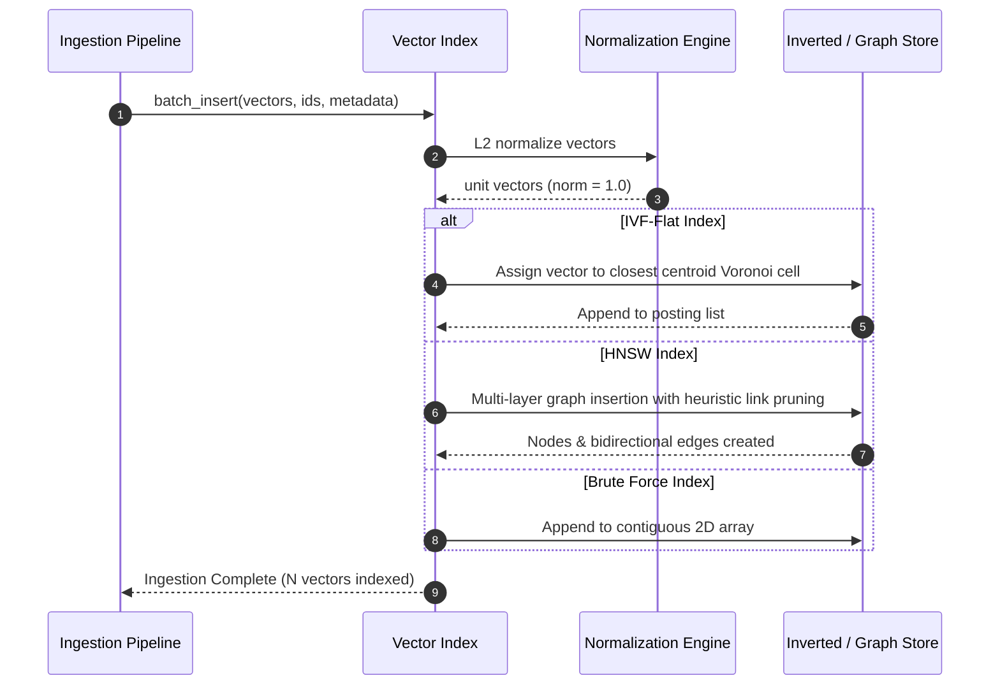
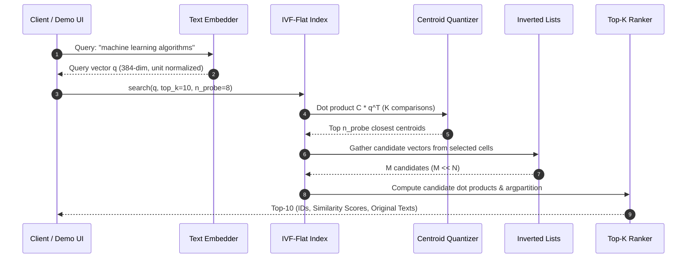

# System Architecture Document

## Project: Custom Vector Database Engine from Scratch
**Status**: Active Architecture Blueprint  
**File**: `docs/architecture.md`

---

## 1. High-Level Architectural Overview

The custom Vector Database (`VFS`) is designed as a modular, decoupled, and strictly dependency-isolated system. It provides high-performance vector search operations while adhering to the primary constraint: **All mathematical and search operations are implemented from first principles using only NumPy.**

```mermaid
graph TD
    subgraph Data & Embedding Layer
        RAW[Raw Text Corpus / Synthetic Generator] --> EMB[Embedding Engine (Sentence-Transformers / Cache)]
        EMB --> VEC_SET[50,000 Ingestion Vectors]
        EMB --> Q_SET[500 Query Vectors]
    end

    subgraph Vector Database Core Layer
        VEC_SET --> BFI[Brute-Force Index (Ground Truth)]
        VEC_SET --> IVF[IVF-Flat Index (Inverted File)]
        VEC_SET --> HNSW[HNSW Index (Hierarchical Graph)]
        
        subgraph Algorithmic Primitives (NumPy Only)
            KM[K-Means from Scratch (k-means++)]
            NORM[L2 Normalization & Dot Product]
            GRAPH[Multi-Layer Skip-Graph Traversal]
        end
        KM --> IVF
        NORM --> BFI
        NORM --> IVF
        GRAPH --> HNSW
    end

    subgraph Service & Evaluation Layer
        Q_SET --> EVAL[Benchmarking & Evaluation Suite]
        BFI -->|Exact Top-10| EVAL
        IVF -->|Approx Top-10| EVAL
        HNSW -->|Approx Top-10| EVAL
        EVAL --> METRICS[Recall@10, Latency p50/p95/p99, Speedup Charts]
    end

    subgraph User & Application Layer
        USER[User Query Statement] --> DEMO[Interactive Demo (Streamlit / CLI)]
        DEMO --> EMB
        DEMO --> IVF
        DEMO --> BFI
        DEMO --> RESULTS[Real-time Best Matches + Timing Comparison]
    end
```

---

## 2. Component Breakdown

The codebase is organized into five core subsystems:

```
IT_Geeks/
├── vectordb/
│   ├── __init__.py
│   ├── base.py              # BaseVectorIndex abstract class
│   ├── brute_force.py       # Exact linear scan index (NumPy matrix operations)
│   ├── ivf_flat.py          # IVF-Flat index (Voronoi partitions + posting lists)
│   ├── hnsw.py              # Hierarchical Navigable Small World graph index
│   ├── kmeans.py            # K-Means clustering algorithm from scratch
│   └── distance.py          # Pure NumPy cosine similarity and euclidean metrics
├── data/
│   ├── dataset_loader.py    # Corpus loader (real text & synthetic clustered data)
│   ├── embedder.py          # Sentence-transformer wrapper & vector cache (.npz)
│   └── corpus/              # Stored text files and pre-computed vectors
├── evaluation/
│   ├── ground_truth.py      # Precomputes exact top-10 for 500 test queries
│   ├── benchmark.py         # Recall@10, latency, QPS, and parameter sweep
│   └── reporter.py          # Formats results into Markdown tables & charts
├── demo/
│   ├── app.py               # Interactive Streamlit Web UI
│   └── cli_demo.py          # Terminal-based interactive query search
└── docs/                    # Architectural & project documentation
```

---

## 3. Subsystem Specifications

### 3.1 Vector Database Core (`vectordb/`)

#### A. Abstract Index Base (`BaseVectorIndex`)
Establishes a uniform polymorphic interface for all index implementations:
- `insert(vector_id: int | str, vector: np.ndarray, metadata: dict = None) -> None`
- `search(query_vector: np.ndarray, top_k: int = 10) -> list[tuple[int | str, float, dict]]`
- `delete(vector_id: int | str) -> bool`
- `batch_insert(vectors: np.ndarray, ids: list, metadatas: list = None) -> None`
- `save(filepath: str) -> None` / `load(filepath: str) -> None`

#### B. Exact Brute-Force Engine (`BruteForceIndex`)
- **Storage**: Dense NumPy 2D array $\mathbf{X} \in \mathbb{R}^{N \times D}$, normalized such that $\|\mathbf{x}_i\|_2 = 1$.
- **Mapping**: Bidirectional dictionary mapping `internal_index <-> external_id` and metadata store.
- **Search Complexity**: $O(N \cdot D)$ arithmetic operations via single BLAS matrix-vector dot product:
  $$\mathbf{s} = \mathbf{X} \mathbf{q}^T$$
  followed by `np.argpartition` for top-$k$ selection in $O(N)$ time.
- **Role**: Serves as the mathematical oracle (Ground Truth).

#### C. Inverted File Index (`IVFFlatIndex`)
- **Centroid Learning**: Custom `KMeansScratch` partitions the $D$-dimensional space into $K$ Voronoi cells.
- **Posting Lists (Inverted Lists)**:
  $$\mathcal{I}_k = \{(\text{vector\_id}, \mathbf{x}_i) \mid \arg\min_c \|\mathbf{x}_i - \boldsymbol{\mu}_c\| = k\}$$
- **Query Routing**:
  1. Compute similarity between query $\mathbf{q}$ and $K$ centroids: $\mathbf{s}_c = \mathbf{C} \mathbf{q}^T$ in $O(K \cdot D)$.
  2. Select top $n_{\text{probe}}$ centroids.
  3. Scan only the vectors residing in those $n_{\text{probe}}$ posting lists.
- **Search Complexity**: $O(K \cdot D + \frac{n_{\text{probe}}}{K} \cdot N \cdot D)$.
  When $K = \sqrt{N}$ and $n_{\text{probe}} \ll K$, search latency drops by orders of magnitude.

#### D. Graph Index (`HNSWIndex`)
- **Structure**: Multi-layer graph $\mathcal{L}_0, \mathcal{L}_1, \dots, \mathcal{L}_{L_{\max}}$.
- **Level Assignment**: Geometric probability distribution $l = \lfloor -\ln(\text{uniform}(0, 1)) \cdot m_L \rfloor$.
- **Navigation**: Greedy routing at upper layers until local minimum is reached, transitioning down to the bottom layer where beam search of size `efSearch` explores the neighborhood.
- **Deletion Strategy**: Tombstone marking (soft delete) with neighborhood reconnection/compaction to prevent graph disconnection.

---

## 4. End-to-End Data & Execution Flows

### 4.1 Ingestion Flow


### 4.2 Query Execution Flow


---

## 5. Architectural Constraints & Quality Attributes

1. **Deterministic Reproducibility**: Random seed fixed to ensure identical clustering and test splits across runs.
2. **Cache First Principle**: Precomputed embeddings and ground truth indices are cached in `.npz` format to allow sub-second application startup.
3. **Memory Footprint Budget**:
   - 50,000 vectors $\times$ 384 dimensions $\times$ 4 bytes (float32) = **76.8 MB**.
   - Overhead for posting lists, metadata, and centroid indices: $< 40$ MB.
   - Total runtime RAM: $< 200$ MB, well within system limits.
